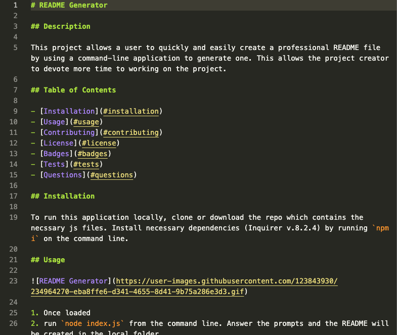

# README Generator

## Description

This project allows a user to quickly and easily create a professional README file by using a command-line application to generate one. This allows the project creator to devote more time to working on the project.

## Table of Contents 

- [Installation](#installation)
- [Usage](#usage)
- [Contributing](#contributing)
- [License](#license)
- [Badges](#badges)
- [Tests](#tests)
- [Questions](#questions)

## Installation

To run this application locally, clone or download the repo which contains the necssary js files. Install necessary dependencies (Inquirer v.8.2.4) by running `npm i` on the command line.

## Usage

[README Generator Video](https://drive.google.com/file/d/1W4upJDEJU6qbvPea6aSCbJffdNa_bCTt/view?usp=sharing)

1. Navigate to the folder where you downloaded the application in the command line,
2. Run the command `node index.js` from the command line
3. Answer the prompts as they appear.
4. The README will be created in the same folder.

## Contributing

- [Use Inquirer.js to Create a Conversational CLI User Interface](https://pakstech.com/blog/inquirer-js/)
- [How to use Inquirer.js](https://javascript.plainenglish.io/how-to-inquirer-js-c10a4e05ef1f)
- [Inquirer.js Examples](https://github.com/SBoudrias/Inquirer.js/)
- [How To Create Interactive Command-line Prompts with Inquirer.js](https://www.digitalocean.com/community/tutorials/nodejs-interactive-command-line-prompts)

## License
  
  

  The MIT License

## Tests

No tests added to this application yet.

## Questions

Created by [vulpesviator](http://github.com/vulpesviator)

[Contact Me](vulpesviator@gmail.com)

Copyright (c) [2023] [Travis Hoffman]
